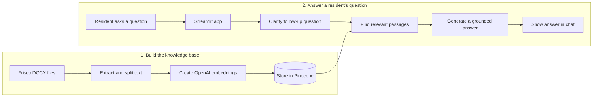

# AskFrisco

AskFrisco is a retrieval-augmented generation (RAG) assistant for answering questions about City of Frisco services, facilities, events, and resident resources. It searches a curated collection of local DOCX documents, supplies the most relevant passages to an OpenAI chat model, and presents the answer in a Streamlit chat interface.

The assistant is intentionally grounded in its knowledge base. When the retrieved documents do not contain enough information, it responds with: `I don't have that info available.`

## Features

- Conversational question answering with follow-up question support
- Semantic search over a Pinecone vector index
- Maximal marginal relevance (MMR) retrieval for varied, relevant context
- DOCX ingestion with source metadata, chunking, and overlap
- Live Frisco date, local time, and weather from Open-Meteo
- Suggested questions and in-session conversation history

## How it works



In short: city documents go into the knowledge base, and a resident's question retrieves only the passages needed to create a grounded answer.

1. `ingest.py` extracts text from every `.docx` file in `data/`.
2. The text is split into overlapping chunks and embedded with OpenAI's `text-embedding-3-small` model.
3. The embeddings and document metadata are stored in Pinecone.
4. `rag.py` rewrites context-dependent follow-up questions, retrieves relevant chunks with MMR, and asks `gpt-4o-mini` to answer using only that context.
5. `app.py` provides the Streamlit user interface and weather panel.

## Project structure

```text
AskFriscoRAG/
|-- app.py              # Streamlit interface
|-- rag.py              # Retrieval and answer-generation pipeline
|-- ingest.py           # DOCX extraction and Pinecone ingestion
|-- requirements.txt    # Python dependencies
|-- data/               # Curated Frisco DOCX source documents
`-- .env                # Local credentials (not committed)
```

## Prerequisites

- Python 3.11 or newer
- An [OpenAI API](https://platform.openai.com/) key
- A [Pinecone](https://www.pinecone.io/) account and serverless index

Create the Pinecone index with these settings:

- Dimensions: `1024`
- Similarity metric: `cosine`

The dimension must match the `text-embedding-3-small` configuration used by both `ingest.py` and `rag.py`.

## Setup

Clone the repository and enter the project directory:

```bash
git clone <repository-url>
cd AskFriscoRAG
```

Create and activate a virtual environment:

```bash
python -m venv .venv
```

On Windows PowerShell:

```powershell
.venv\Scripts\Activate.ps1
```

On macOS or Linux:

```bash
source .venv/bin/activate
```

Install the dependencies:

```bash
python -m pip install -r requirements.txt
```

Create a `.env` file in the project root:

```dotenv
OPENAI_API_KEY=your_openai_api_key
PINECONE_API_KEY=your_pinecone_api_key
PINECONE_INDEX=your_pinecone_index_name
```

The `.env` file is excluded from Git. Do not commit API keys.

## Build the knowledge base

Place the source `.docx` files in `data/`, then run:

```bash
python ingest.py
```

The script discovers all DOCX files in the folder, extracts their text, splits it into chunks, and uploads the resulting embeddings to the configured Pinecone index.

> Re-running ingestion against the same index may add duplicate content. For a clean rebuild, clear or recreate the Pinecone index first.

## Run the app

```bash
streamlit run app.py
```

Open the local URL printed by Streamlit, usually `http://localhost:8501`.

Example questions:

- When does the Frisco City Council meet?
- What time does the Frisco Skate Park close?
- When should I put out my trash cart?
- Do I need a special-event permit?

## Configuration

The primary model and retrieval settings are defined in the source files:

| Setting | Current value | Location |
|---|---:|---|
| Chat model | `gpt-4o-mini` | `rag.py` |
| Embedding model | `text-embedding-3-small` | `rag.py`, `ingest.py` |
| Embedding dimensions | `1024` | `rag.py`, `ingest.py` |
| Retrieved chunks | `4` | `rag.py` |
| MMR candidate chunks | `10` | `rag.py` |
| Chunk size | `1000` characters | `ingest.py` |
| Chunk overlap | `150` characters | `ingest.py` |
| Weather cache | `10` minutes | `app.py` |

If you change the embedding model or dimensions, create a compatible Pinecone index and ingest the documents again.

## Limitations

- Answers are limited to information present in the ingested documents.
- The knowledge base is only as current as the files in `data/` and the latest ingestion run.
- Conversation history is stored only in the current Streamlit session.
- Weather data depends on the external Open-Meteo service and may occasionally be unavailable.
- Generated answers should be verified against official City of Frisco sources before making important decisions.

## Updating the documents

1. Add, replace, or remove DOCX files in `data/`.
2. Clear or recreate the Pinecone index to avoid stale or duplicate chunks.
3. Run `python ingest.py` again.
4. Restart the Streamlit app if it is already running.
